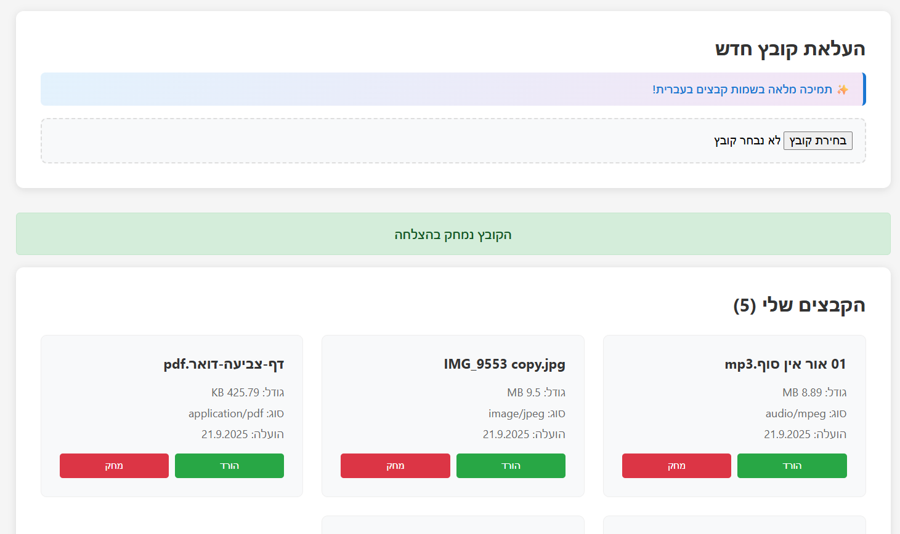

# אתר אחסון קבצים פשוט 🗂️

אתר פשוט לאחסון קבצים עם תמיכה בעברית וכיוון מימין לשמאל.



## תכונות ✨

- 📝 הרשמה והתחברות משתמשים
- 📁 העלאת קבצים עם תמיכה מלאה בשמות בעברית
- 📥 הורדת קבצים
- 🗑️ מחיקת קבצים
- 🇮🇱 תמיכה מלאה בעברית וכיוון RTL
- 🐳 פריסה עם Docker

## 🚂 העלאה ל-Railway

### דרישות מוקדמות
1. Git מותקן על המחשב

### שלבי ההעלאה

1. **צור repository ב-GitHub:**
   ```bash
   git init
   git add .
   git commit -m "Initial commit"
   git branch -M main
   git remote add origin YOUR_GITHUB_REPO_URL
   git push -u origin main
   ```

2. **התחבר ל-Railway:**
   - כנס ל-[Railway](https://railway.app)
   - התחבר עם GitHub
   - לחץ על "New Project"
   - בחר "Deploy from GitHub repo"
   - בחר את הrepository שיצרת

3. **הגדר את משתני הסביבה:**
   - `NODE_ENV=production`
   - `JWT_SECRET=your-secret-key-here`
   - `PORT=3001`

4. **הוסף מסד נתונים:**
   - לחץ על "Add Service" -> "Database" -> "PostgreSQL"
   - Railway יחבר אוטומטית את מסד הנתונים

## 🏠 הפעלה מקומית

```bash
# הפעלה עם Docker
docker-compose up --build

# או הפעלה ללא Docker
cd backend && npm install && npm start
cd frontend && npm install && npm start
```

## 📱 גישה לאתר

- **Frontend (אתר)**: Port 3000
- **Backend (API)**: Port 3001
- **Database**: Port 5432

## 🛠️ מבנה הפרויקט

```
simple-file-app/
├── backend/          # שרת Node.js + Express
├── frontend/         # אפליקציית React
├── uploads/          # תיקיית קבצים שהועלו
├── docker-compose.yml
├── Dockerfile
└── README.md
```

## 🔐 ביטחון

- סיסמאות מוצפנות עם bcrypt
- אימות JWT
- CORS מוגדר נכון
- ולידציה של קלט משתמש
